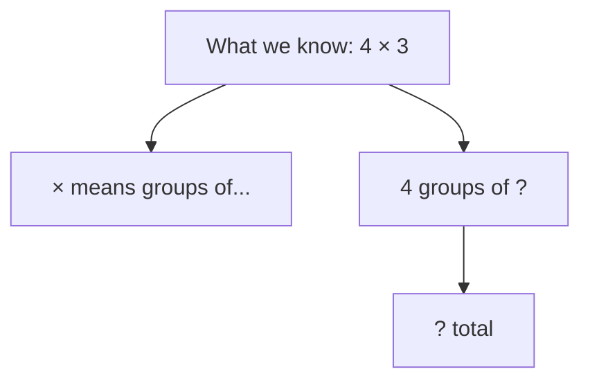
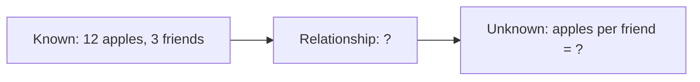
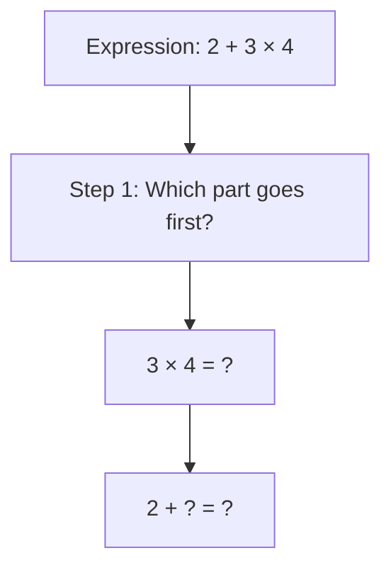
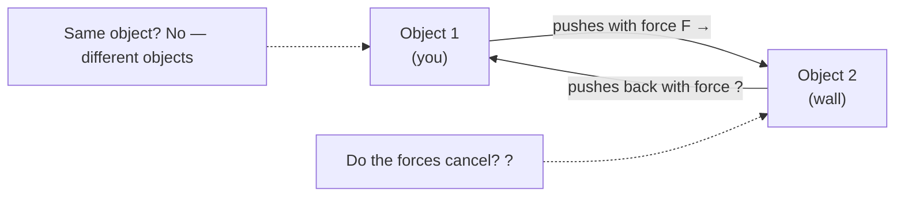
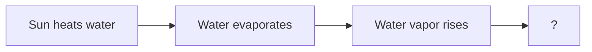
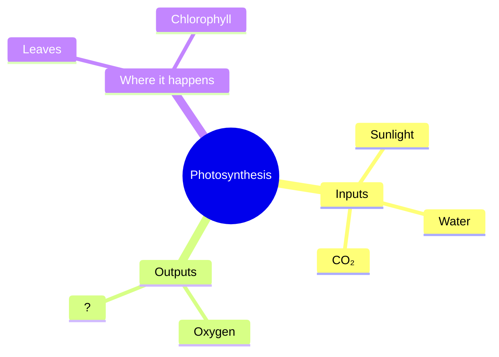
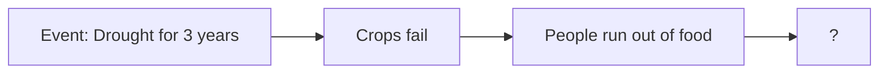
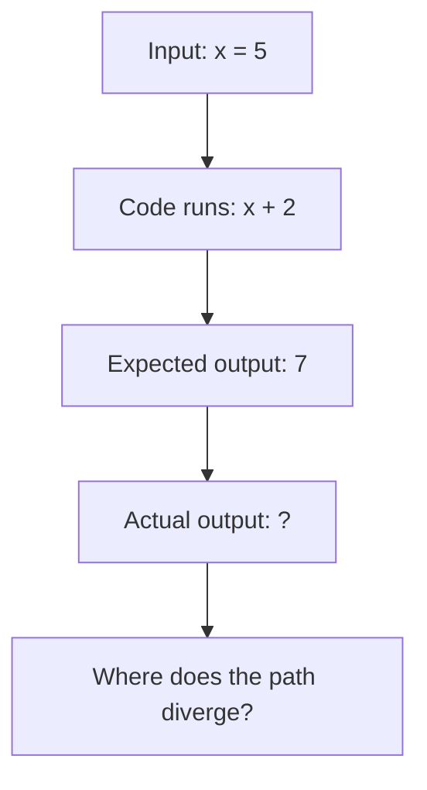
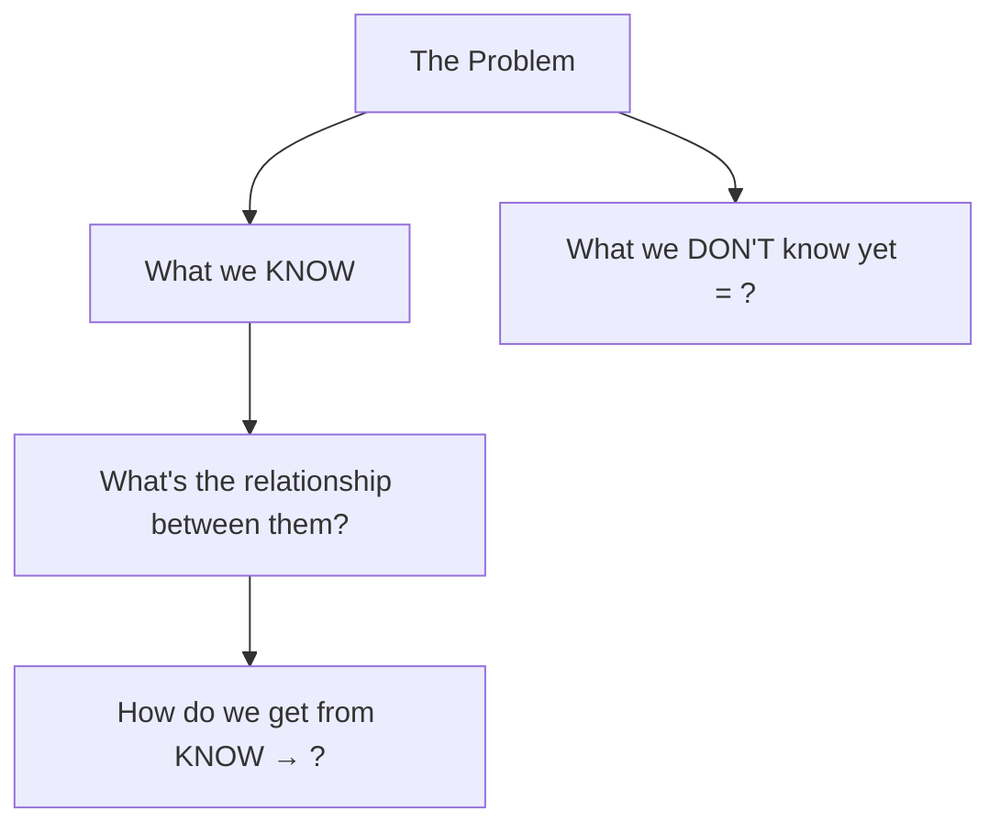

# Diagram Patterns by Problem Type

Always use Mermaid diagrams. Always leave the critical unknown as a `?` node.
The diagram shows **structure**, never **solution**.

---

## Math — Arithmetic / Equation

Show the components of the equation as a tree. Leave the result as `?`.



Ask after: *"Looking at this — what does the × sign tell us to do?"*

---

## Math — Word Problem

Extract knowns, unknowns, and the relationship between them.



Ask after: *"What operation connects 'groups' to 'total'?"*

---

## Math — Order of Operations

Show the expression as a step-by-step tree, with the final step blank.



Ask after: *"Why does one part have to come before the other?"*

---

## Science — Newton's 3rd Law / Force Pairs

Show two objects and the forces between them. Leave the direction/magnitude of the reaction force as `?`.



Ask after: *"The arrows go in opposite directions — what do you notice about where each arrow starts and ends?"*

---

## Science — Cause and Effect

Build a causal chain. Leave the final effect as `?`.



Ask after: *"What do you think happens when lots of water vapor collects in one place?"*

---

## Science — Concept Mind Map

Place the concept at the center. Show its components as branches. Leave one branch as `?`.



Ask after: *"What do you think the plant is making for itself from all those inputs?"*

---

## History / Social Studies — Timeline / Cause Chain

Show events as nodes. Leave the outcome node as `?`.



Ask after: *"What usually happens when a large group of people can't get food?"*

---

## Reading Comprehension — Passage Breakdown

Label each section of the passage structurally.

```
[Section 1 — Setup]
"It was a dark and stormy night..."
→ What is being introduced here?

[Section 2 — Problem/Conflict]
"Suddenly the lights went out..."
→ What changed? Why does it matter?

[Section 3 — Detail]
"She reached for the flashlight..."
→ What does this tell us about the character?

[Question]
"Why did she reach for the flashlight instead of leaving?"
→ What do YOU think the reason is, based on what you read?
```

Ask after: *"Before we answer the question — what kind of person does the author want us to think she is?"*

---

## Coding — Bug / Logic Problem

Show the intended flow vs. what the code actually does.



Ask after: *"At which step does what the code does stop matching what you expected?"*

---

## General — Unknown Problem Type

When the problem doesn't fit a category, use this structure:



Ask after: *"Looking at this — which of the 'known' pieces feels most useful to start with?"*
