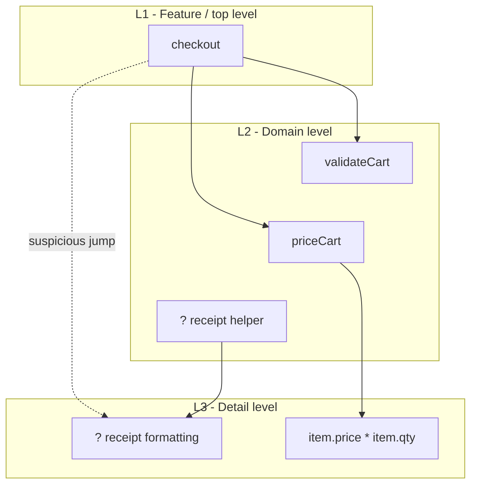
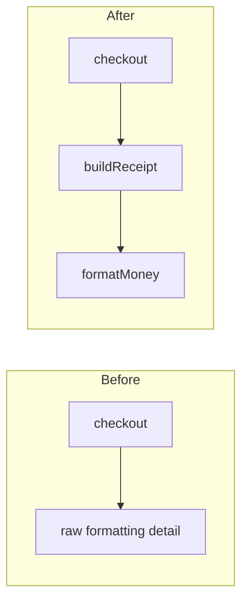

# Socratic Question Bank - Stratified Design

Use these patterns to guide discovery. Rotate them.

## Level Naming

- "What level of meaning is this line using: feature, domain, detail, or external action?"
- "If this line had a label in a call graph, where would it sit?"
- "Which words here belong to the problem domain, and which words belong to implementation detail?"

## Directness

- "Does this function tell one story, or does it change altitude mid-sentence?"
- "If you hid the helper bodies, would the caller still read clearly?"
- "Which line forces the reader to think too low-level too early?"

## Wrapper Test

- "What name would let the caller stop knowing these details?"
- "Are these lines a real concept, or just a chunk of code?"
- "Would you expect to reuse this name elsewhere?"

## Change Test

- "If the rounding rule changed, which function should change?"
- "If shipping changed, should the top-level function notice?"
- "Which helper owns this decision?"

## Diagram Prompts

Use `showDiagram` after the learner has attempted the classification. Do not
draw diagrams as text or fenced Mermaid blocks in chat.

- "Looking at this call graph, which edge jumps more than one level?"
- "Which node is a wrapper, and what details does it hide?"
- "If we added a domain helper, where would it fit?"

Default call graph shape:



For level diagrams, use `flowchart TD` and stack subgraphs L1, L2, then L3.
When a real edge jumps from L1 to L3, keep the dotted jump visible, but add a
missing L2 placeholder that points to the L3 detail. This makes the skipped
middle concept visible and keeps L3 below L2 instead of beside it.

Default wrapper-before/after shape:



## Stuck Playbook

1. Zoom to two adjacent lines.
2. Ask whether they are at the same level.
3. If not, ask for a name that could sit between them.
4. Write only a skeleton with `???` holes if needed.

Example detour:

```ts
// --- detour ---
// These three lines are details:
const rounded = Math.round(total * 100) / 100;
const dollars = rounded.toFixed(2);
const label = "$" + dollars;

// What domain-level name would let the caller ask for this in one line?
function ???(total: number): string {
  return ???;
}
```

## Disengaged Playbook

When the learner gives repeated one-word answers or leaves the file untouched:

- Stop asking open questions.
- Write a binary choice into the file.
- Make the next action physical: delete one option, rename one function, or move
  one line.

Example:

```ts
// Pick one by deleting the other:
// This function tells one clear story.
// This function mixes levels.
```
